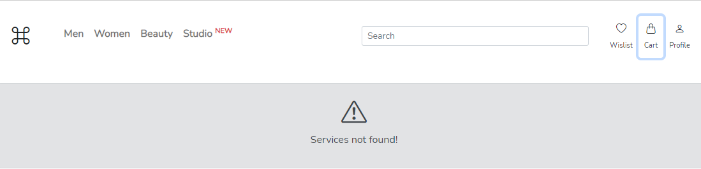
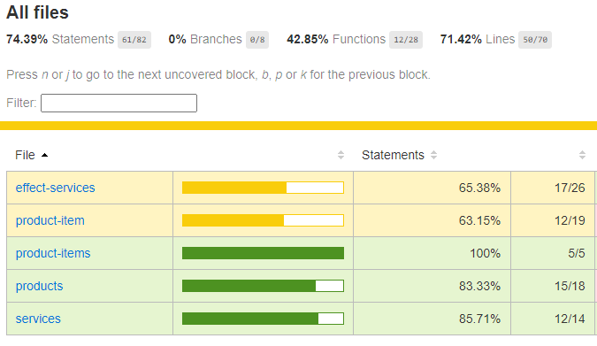
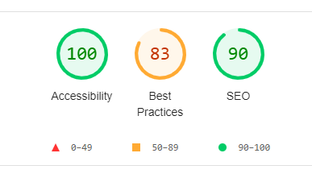

# RockBand

Features Enabled:

- Modularize App Structure
- Typescript Enabled
- Advance NgRx Store Implementation (using EntityAdapter, EntityState etc.)
- Ng-bootstrap Enabled
- Advance Angular features implementation (@Inject, Token etc)
- Custom Angular Pipe Module (ProductPipesModule) implementated
- Auxiliary Routing implemnetation for individual angular modules
- Custom Http Error Handing using HttpInterceptor
- Using environment variables for external API endpoints
- Git Actions for CI/CD Pipelines
- Code Coverage Enabled for Each Angular Modules
- Application Theme Structured
- Storybook Enabled
- Dockerize Implementation

### Product and Shopping Cart Modules Layout

---

### Project Script Guide:

Navigate to `Frontend-Starter\FE\rock-band` folder

- Setup Application
  - `yarn install`
- Run Development Environment
  - `yarn rock:dev`
- Run Storybook
  - `yarn rock:storybook`
- Run Tests
  - `yarn rock:test`
  - `yarn rock:cart:test`
  - `yarn rock:product:test`
- View Code Coverage of the Application
  - `yarn rock:cc`
  - `yarn rock:cart:cc`
  - `yarn rock:product:cc`
- Run Lint and Prettier
  - `yarn rock:lint`
  - `yarn rock:format`

### Module-wise Error Handing

### Code Coverage Report

### Lighthouse Report

### Storybook Feature

This project was generated using [Nx](https://nx.dev).
